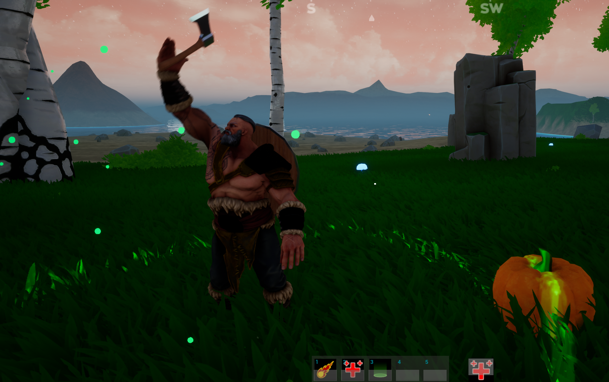

## Introduction

## Progress

### Week Sixteen

For our final week, we spent a lot of time working on several small issues and taking out some mechanics which where broken / unfinished. Our main issue with the project was once again.. replication.

We added a new player character model along with an axe and shield. The axe and shield would be attached to the player character armature using sockets. This would allow for the switching of new equipable weapons later on.

LOADINGSCREEN - HERE

(_ChatBox_)

To allow those without a mic to communicate, we added a basic chat system whuich is fully replicated.

We made a start on the options menu but ran into several problems regarding settings, unfortunatly the options menu is disabled for now.

New sounds where added to the project, main for menu interaction and gameplay background tracks.

We added a new melee attack system which we finally got replicated as well as having the animations set up correctly. The top half of the players character was split which allowed us to blend animations such as attacking while moving.

Along with our new melee attack, we added a block, is replicated but the blocking logic is just not quite finished.

Lastly we had created new enemy NPCs which would roam until a player was within range. The NPC would strafe and then engage with the player using melee combat, this just allowed for a little more difficulty when it came to combat. (Due to an issue with the terrain generation, all NPCs will only work sometimes, Random NPCs will get stuck)

### Week Fifteen

For this week we created an NPC spawner which would be used for all AI. This will allow us to set the max amount of NPCs to be in certain areas as well as help with loading and spawning NPCs outside of the players vision.

(_CharacterSheet_)

We added a character sheet window so that the player would be able to equipt armour and weapons while also viewing stat changes. This was made in preperation of an inventory rework.

(_AoEHeal_)

Throughtout the whole project we have been having difficulties with replication, and so though we still used the gameplay ability system, we set up a new structure for abilities which would be slotted onto the action bar. We created 3 new abilities:

- Fireball: A ranged projectile which would cause fire damage.
- Resilience: An self buff which would increase the players max hp for a shot period of time.
- Natures Spirit: An AoE ability which would heal the player and future friendlies over time.

As we would now have new 'active' effects, we added a panel which would display buffs which are active as well as the time left on them.

### Week Fourteen

This week we decided to adjust the map generation as a lot of terrain was just far to steep for the player to taverse, having done this we have a much better result than our previous map, though there are still some parts of the map that needs adjusting.

(_MainMenu_)

Given that the main menus background was just just a flat image, we created a new map for the main menu and changed th background to a live animated scene which is far more pleasing to look at.

(_HungerAndThirst_)

Two new attribute where created for the player character, hunger and thirst. These attributes will slowly drain over time with thirst draining slightly faster. We plan to add consumables for the player to satisfy hunger and thirst.

(_AbilityBar_)

Given that we are aiming for creating an ARPG, we added the ability for ability slots on the action bar to be rebinded, allowing the activation of abilities using keybinds instead of clicking.

### Week Thirteen

For this week we worked on fixing some minor issues as well as adjusting some umg elements.

We also decided that we would include a mini map for the player to view his surroundings as well as points of interests close by. 

(_Minimap_)

To compliment the minimap, we added in a compass to the top of the screen which would help with POIs which are out of range of the minimap.

(_Compass_)

To have a smoother transition between menus and hosted game levels, we add in async loading screens.

(_LoadingScreens_)

### Week Twelve

For this week, We decided to change how we wanted our game to look. Instead of going for realisic graphics, we decided that we would make the game look more cartoony as it would fit the fantasy setting better.

(_VisualOverhaul1_)

(_VisualOverhaul2_)

While changing out the graphics we, configured a new map which is much smaller than the one we where using previously to help with preformance.

(_NewMapGeneration_)

### Week Eleven

For this week, We took a break from asset creation and issues and started to add new features to our game.

As we want the players to be able to communicate in game, we implimented VOIP. To show when the players mic is live, we added an icone to be displayed at the top left corner of the screen. We plan to add in a chat box next week.

(_VOIPIcon_)

We created a basic inventory system using C++ which will hold items the players pickup in game.

(_BasicInventory_)

(_BasicInventory2_)

For our first basic AI, we added in some wild life. For now we have a deer which will walk randomly until it gets tired. In order for the deer to regain its energy it will lay down to rest providing it is not in danger.

(_DeerWandering_)
.png)

(_DeerResting_)
.png)

### Week Ten

For this week, We spent most of our time fixing issues and asset creation.

We are still currently working on assets to bring into our game.

As we want it to be possible for the player to create their own abilities in game, We also created the UI for the player spell book as well as started working on centeralizing the gameplay ability system to make this possible. ( Spell book is currently disabled due to issues )

(_MockSpellBookUMG_)

### Week Nine
This week we added 2 new attributes for the player, OverAllDamageToDeal and OverallDamageToTake, which would allow us to calculate up any effects and add them to a single output with the recieving target only having one input. 

We added a new ability to the player which they could use to buff one of their stats, in this case, physical attack damage which would then be added to the players OverallDamageToDeal attribute. 

(_BuffAbilityAnimation_)

(_DefaultPhysicalDamage_)

(_BuffedPhysicalDamage_)

The majorty of the week was spent debugging and testing different abilities, one of the main problems we encountered was animation replication. To replicate the animations, we created gameplay cues that would play an animation montage. Through research we found that gameplay abilities cannot be replicated and that only gameplay cues and effects can.

One of the abilities we created, allowed the player to slide which worked accroess the network and allows the player to slide under object. Unfortunatly due to conflicts with github, we had to roll back meaning this was lost, but we plan to add it back.

### Week Eight
This week we decided to start the base for the players HUD. We added progress bars for the players health, stamina and magic attributes which will update based on the players current attributes. An 'action bar' has also been added which we plan to make use of with the ability system for dragable ability icons.

(_MaxHealthBasicHUD_)

(_UpdatedhealthBasicHUD_)

Up to now, we where only able to have 2 players max on a server at any one time despite allowing for 5 users, after some research we where able to fix this issue.

(_ThreePlayersViaSteam_)

Having reciently added an ability to punch, we face an issue with replication for animation and with many hours of trial and error we where able to finally replicate one client punching and damaging another client. 

### Week Seven
This week using the ability system we previously set-up, we have created a new attribute set that each player will be given as default such as:

  - Physical Attack
  - Physical Defence
  - Magic Attack
  - Magic Defence
  - Health
  - Stamina
  - Mana
  - Oxygen
  - Various Resistance Attributes

As well as attributes, we had created the first default player abiltiy which was a simple melee attack. Using these attributes as well as the melee ability, we where able to deal damage from one player to another accross the network based on our attributes.

(_MeleeAttack_)

Given that we will have various events happen based on time, we decided we would add a day / night cycle. In this day / night cycle we made sure that the sun skybox moved along  with the direction light.

(_Day/Night Cycle_)

We looked into several different methods to impliment swimming, we choose to use the 3rd person character swimming enum. To allow the user to swim when they enter the water and float when they stop in water.

(_Swimming1_)

(_Swimming2_)

(_Swimming3_)

LOD optomization
Chunk size reduced from 64 to 32

### Week Six
This week we decided to work on setting up the foundations for an ability system. Having spent time researching vaious ability systems, we found unreals GAS (Gameplay Ability System) and decided that we would use this in our project. Most of the week was learning how to use this system and setting up the foundations for abbilities and attributes sets to be created.

### Week Five
Bank holiweek :)
(Busy with personal events)

### Week Four
This week we have been studying on how to use the voxel foliage spawn system on different heights of a IQ noise map. After alot of trail and error we finally managed to get a basic terrain immplemented witch had different height spawners depending on the how high the land was above sea level. We then adjusted the spawners and turned off shadows for grass, flowers and small rocks to improve performance. 

(_World Height Map_)

This height map was created using an IQ noise and we then applied textures to it depending on how high each area was from sea level.

(_Forest_)

Picture of the forest area with all foliage spawning as intended.

(_Volumetric Fog_)

Showcasing a light blue/aquamarine tint to volumetric fog in our forest and near shore height.

(_Shore_)

Picture of the shore area near the forest

(_Cave_)

Picture of a hand sculpted cave using the voxel terrain manipulator tools and unreal 4.26 water 

### Week Three

Having completed our research and a lot of planning, we where ready to begin developing our game. Throughout the week, We have created a basic menu system, set-up the foundations and currently have working multiplayer using Steam services. 

(_Main Menu_)

(_Host Menu_)

(_Server List Menu_)

(_2 players connected_)

(_Escape Menu_)

We decided to use the Voxel plugin for unreal as it allows us to randomly generate terrains which would help with speed when designing levels and a possible feature for the player to use to interact / manipulate terrain. 
The free version of the plugin provided us with basic terrain generation and allowed us to shape our worlds but it was missing the ability to spawn meshes so we could not paint our foliage. We then decided to use the pro version which came with this feature and allowed us to edit the terrain and control it using graphs.

(_Terrain Manipulation And generation Using Voxels_)

(_Cave System Using Voxels_)

As we are a small team of two and would have multiple roles to cover such as creating our own assets, we decided to learn a new software which we would be using called Blender. This would give us a lot more control over how the game will look as well as keeping the games art style consistant, this didn't prove to time consuming as all members of the team have experience with asset creation.

(_Modelling Practice Using New Software (Blender)_)

### Week Two

Our first couple of weeks where dedicated to research and planning for our project so that it we would get a better understanding of how we will accomplish certain tasks as well as to create a base guidline to stick to throughout the projects development. 

Having spent a lot of time researching various game genres and mechanics before we decided that we would develop an online multiplayer, fantasy, survival game which would be inspired from games such as Rust, Ark and 7DTD with our target release platform being Steam. Although the idea will be heavely inspired from these games, we had designed a unique skill and ability system which will make ours stand out.

### Week One

For our first week of the project, we had mostly been brainstorming ideas for the type of game we want to develop.
